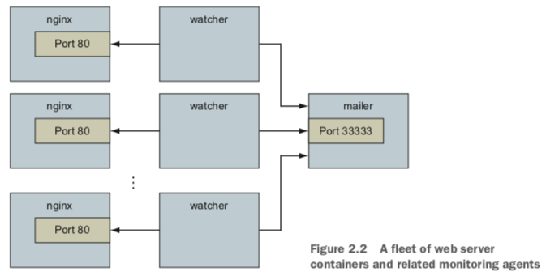

# The legacy of container network linking

You may notice that the Docker documentation describes `network links` (`--link`) as a legacy feature. Network links were an early and popular way to connect containers. Links cre- ate a unidirectional network connection from one container to other containers on the same host. Significant portions of the container ecosystem asked for fully peered, bidirectional connections between containers. Docker provides this with the `user-defined networks` described in chapter 5. These networks can also `extend across a cluster of hosts` as described in chapter 13. Network links and user-defined networks are not equivalent, but Docker recommends migrating to user-defined networks.

It is uncertain whether the container network linking feature will ever be removed. Numerous useful tools and unidirectional communication patterns depend on linking, as illustrated by the containers used to inspect and watch the web and mailer com- ponents in this section.
