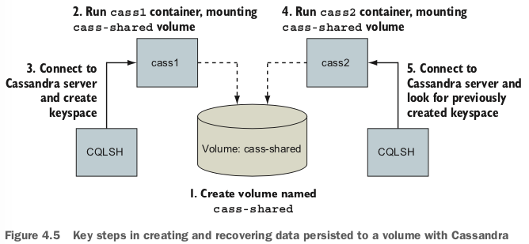

# --volumes-from

Copied volumes always have the same mount point. That means that you can’t use --volumes-from in three situations.
In the first situation, you can’t use --volumes-from if the container you’re build- ing needs a shared volume mounted to a different location. It offers no tooling for remapping mount points. It will only copy and union the mount points indicated by the specified containers. For example, if the student in the previous example wanted to mount the library to a location like /school/library, they wouldn’t be able to do so.

The second situation occurs when the volume sources conflict with each other or a new volume specification. If one or more sources create a managed volume with the same mount point, a consumer of both will receive only one of the volume definitions:

The third situation in which you can’t use --volumes-from occurs when you need to change the write permission of a volume. This is because --volumes-from copies the full volume definition. For example, if your source has a volume mounted with read/write access, and you want to share that with a container that should have only read access, using --volumes-from won’t work.

Sharing volumes with the --volumes-from flag is an important tool for building portable application architectures, but it does introduce some limitations. The more challenging of these are in managing file permissions.
