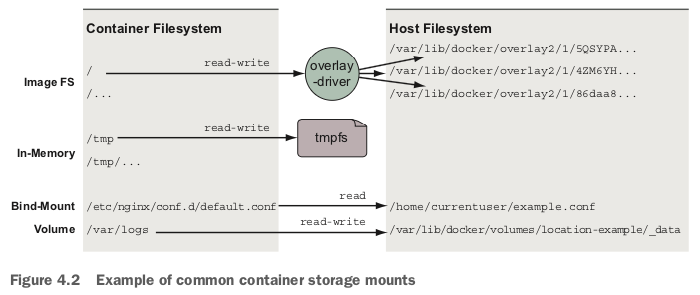
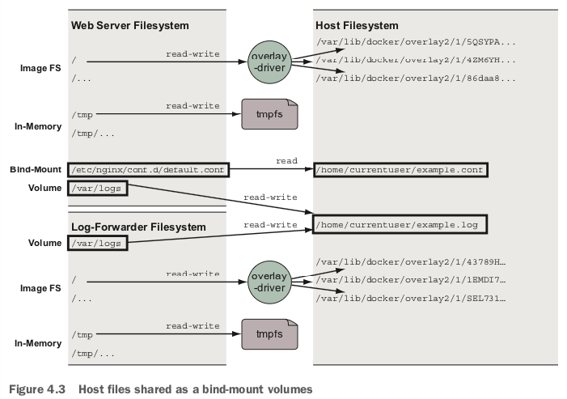

The three most com- mon types of storage mounted into containers:

- Bind mounts - mount points used to remount parts of a filesystem tree onto other locations
- In-memory storage
- Docker volumes

# Bind mounts

The first problem with bind mounts is that they tie otherwise portable container descriptions to the filesystem of a specific host. If a container description depends on content at a specific location on the host filesystem, that description isn’t portable to hosts where the content is unavailable or available in some other location.

The next big problem is that they create an opportunity for conflict with other containers. It would be a bad idea to start multiple instances of Cassandra that all use the same host location as a bind mount for data storage. In that case, each of the instances would compete for the same set of files. Without other tools such as file locks, that would likely result in corruption of the database.

Bind mounts are appropriate tools for workstations, machines with specialized concerns, or in systems combined with more traditional configuration management tooling. It’s better to avoid these kinds of specific bindings in generalized platforms or hardware pools.

# In-memory storage

Most service software and web applications use private key files, database passwords, API key files, or other sensitive configuration files, and need upload buffering space. In these cases, it is important that you never include those types of files in an image or write them to disk. Instead, you should use in-memory storage.

# Docker volumes

Docker volumes are named filesystem trees managed by Docker. They can be imple- mented with disk storage on the host filesystem, or another more exotic backend such as cloud storage. 

By default, Docker creates volumes by using the `local volume plugin`. The default behavior will create a directory to store the con- tents of a volume somewhere in a part of the host filesystem under control of the Docker engine.

Sharing access to data is a key feature of volumes.

Images are appropriate for packaging and distributing rel- atively static files such as programs; volumes hold dynamic data or specializations.
