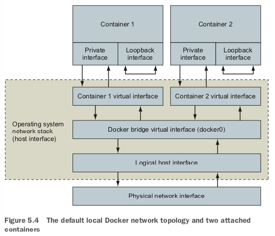

# protocol

- A protocol with respect to communication and networking is a sort of language. Two parties that agree on a protocol can understand what the other is communicating.

# interface

- A network interface has an address and represents a location.
- It’s common for computers to have two kinds of interfaces: an Ethernet interface and a loopback interface. 
- An Ethernet interface is what you’re likely most familiar with. It’s used to connect to other interfaces and processes. 
- A loopback interface isn’t con- nected to any other interface.

# port

- In keeping with the mailbox metaphor, a port is like a recipient or a sender.
- Ports are just numbers and defined as part of the Transmission Control Protocol (TCP) or User Datagram Protocol (UDP).

# Networks

- Interfaces are single points in larger networks. Networks are defined in the way that interfaces are linked together, and that linkage determines an interface’s IP address.

# bridge

- A virtual network that Docker creates to connect all of the running containers to the network that the computer is connected to.
- A bridge is an interface that connects multiple networks so that they can function as a single network.

# DNS

Domain Name System (DNS) is a protocol for mapping hostnames to IP addresses.

# Docker container networking

- Docker abstracts the underlying host-attached network from containers. Doing so pro- vides a degree of runtime environment agnosticism for the application, and allows infra- structure managers to adapt the implementation to suit the operating environment.
- By default, Docker includes three networks, and each is provided by a different driver.
  - `bridge` network is the default network and provided by a bridge driver. provides intercontainer connectivity for all containers running on the same machine.
  - `host` network is provided by the host driver, which instructs Docker not to create any special networking namespace or resources for attached containers.
  - `none` network uses the null driver. Containers attached to the none network will not have any network connectivity outside themselves.
- The scope of a network can take three values: `local`, `global`, or `swarm`.
  - whether the network is constrained to the machine where the network exists (local) - all of the default networks have the local scope
  - should be created on every node in a cluster but not route between them (global)
  - seamlessly spans all of the hosts participating in a Docker swarm (multi- host or cluster-wide)

# Special container networks: host

- When you specify the --network host option on a docker run command, you are telling Docker to create a new container without any special network adapters or network namespace. Whatever software is running inside the resulting container will have the same degree of access to the host network as it would running outside the container. Since there is no network namespace, all of the kernel tools for tuning the network stack are available for modification (as long as the modifying process has access to do so).
- host network is useful for system services or other infrastructure com- ponents
- not appropriate in multitenant environments and should be disal- lowed for third-party containers

# Special container networks: none

- Creating a container on the none network instructs Docker not to provision any connected virtual Ethernet adapters for the new container. It will have its own network namespace and so it will be isolated, but without adapters connected across the namespace boundary, it will not be able to use the network to communicate outside the container.
- Containers configured this way will still have their own loopback interface, and so multiprocess containers can still use connections to localhost for interprocess communication.
- Only network interface available is the loopback interface, bound to the address 127.0.0.1. This configuration means three things:
  - Any program running in the container can connect to or wait for connections on that interface.
  - Nothing outside the container can connect to that interface.
  - No program running inside that container can reach anything outside the
container.

# Summary

- Containers on the none network are isolated from each other and the rest of the world, but remember that even containers on the bridge network are not directly routable from outside the host running the Docker engine.
- Bridge networks use network address translation (NAT) to make all outbound container traffic with destinations outside the bridge network look like it is coming from the host itself. This means that the service software you have running in containers is isolated from the rest of the world, and the parts of the network where most of your clients and customers are located. The next section describes how to bridge that gap.
