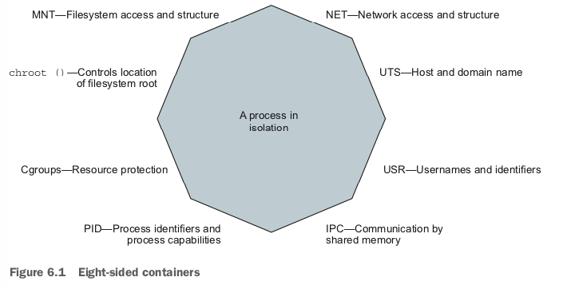

# Sharing memory

Linux provides a few tools for sharing memory between processes running on the same computer. This form of `interprocess communication` (IPC) performs at memory speeds. It’s often used when the latency associated with network or pipe-based IPC drags software performance down below requirements. The best examples of shared memory-based IPC use are in scientific computing and some popular database tech- nologies such as PostgreSQL.
