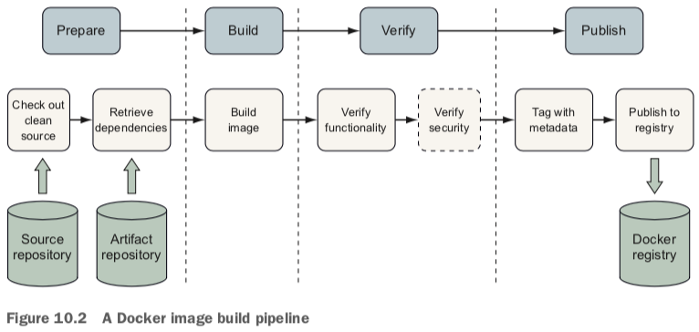
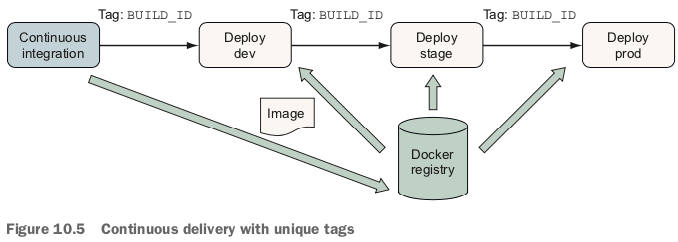
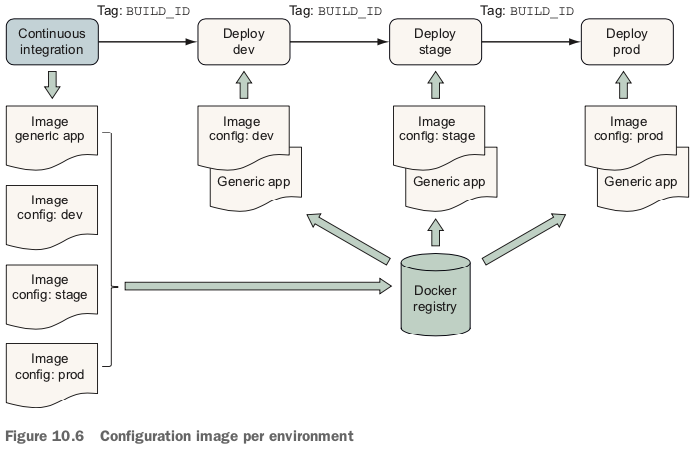
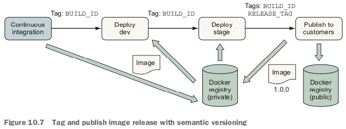

# Image build pipeline

When building a Docker image, this process includes the following steps:

1. Check out a clean copy of the source code defining the image and build scripts so the origin and process used to build the image is known.
2. Retrieve or generate artifacts that will be included in the image, such as the application package and runtime libraries.
3. Build the image by using a Dockerfile.
4. Verify that the image is structured and functions as intended.
5. (Optional) Verify that the image does not contain known vulnerabilities.
6. Tag the image so that it can be consumed easily.
7. Publish the image to a registry or another distribution channel.

# Patterns for building images

- All-in-One—You use an all-in-one image to build and run the application.
- Build Plus Runtime—You use a build image with a separate, slimmer runtime
image to build a containerized application.
- Build Plus Multiple Runtimes—You use a slim runtime image with variations for
debugging and other supplemental use cases in a multi-stage build.

# Container linting tool - hadolint

- https://github.com/hadolint/hadolint

The linter checks Dockerfiles to verify that they follow best practices and identify common mistakes.

Hadolint is one of several linters available for Dockerfiles.

# Container Structure Test tool - CST

- https://github.com/GoogleContainerTools/ container-structure-test

Docker image is the Container Structure Test tool (CST) from Google

# Patterns for tagging images

The most important image-tagging features to understand are as follows:

- Tags are human-readable strings that point to a particular content-addressable image ID.
- Multiple tags may point to a single image ID.
- Tags are mutable and may be moved between images in a repository or removed entirely.

Common tagging and deployment schemes include the following:

- Continuous delivery with unique tags: Pipelines promote a single image with a `unique tag` through delivery stages.

- Continuous delivery with environment-specific artifacts: Pipelines produce `environment-specific` artifacts and promote them through development, stage, and production.

- Semantic versioning: Tag and publish images with a `Major.Minor.Patch` scheme that communicates the level of change in a release.
- Semantic versioning (https://semver.org/) is a popular approach to versioning artifacts with a version number of the form Major.Minor.Patch.
  1. Major version when making incompatible API changes
  2. Minor version when adding functionality in a backward-compatible manner
  3. Patch version when making backward-compatible bug fixes

