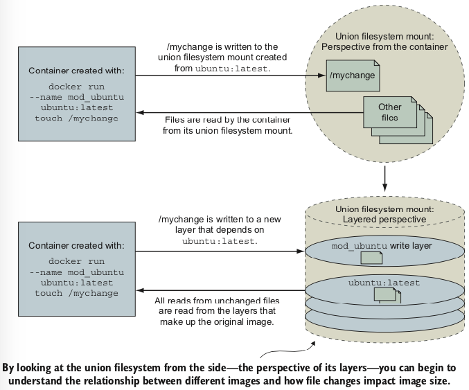
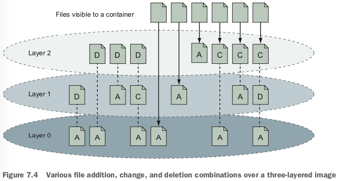
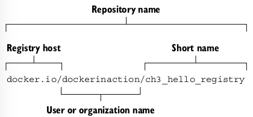
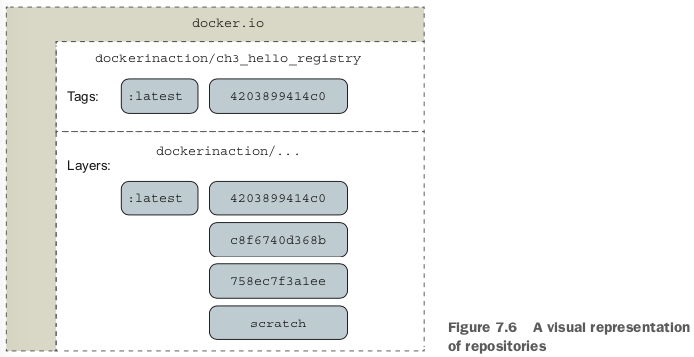

# union filesystem

A `union filesystem` is made up of layers. Each time a change is made to a union filesystem, that change is recorded on a new layer on top of all of the others. The `union` of all of those layers, or top-down view, is what the container (and user) sees when accessing the filesystem. 

# Name

