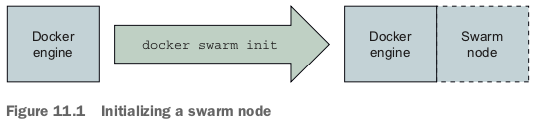
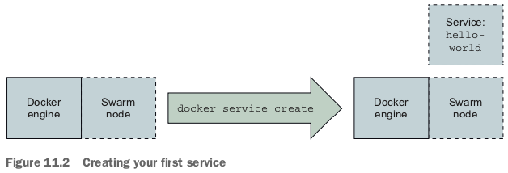
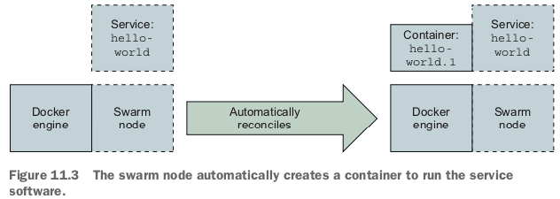
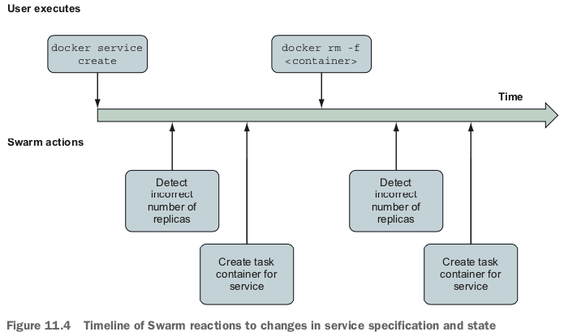
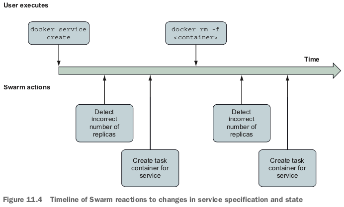
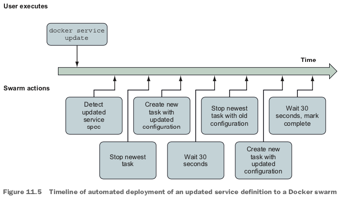

# Service

Any processes, functionality, or data that must be discoverable and available over a network is called a service.

# Task

A task is a swarm concept that represents a unit of work. Each task has one associ- ated container. 

Although there could be other types of tasks that don’t use containers, those are not the subject of this chapter.

Swarm works only with tasks.
 
# Automated resurrection and replication

A `replication mode` tells Swarm how to run replicas of the workload.

The second mode, `global`, tells Docker to run one replica on each node in the swarm cluster.
