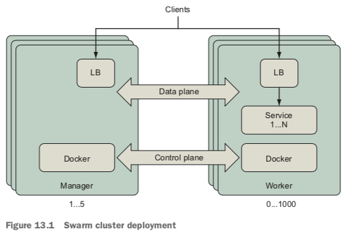
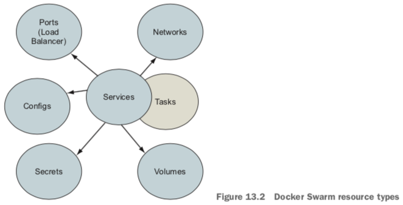
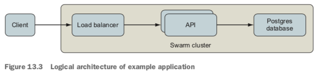
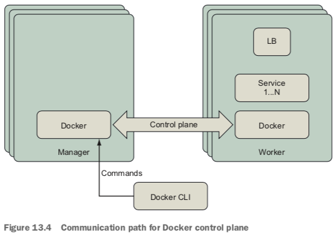
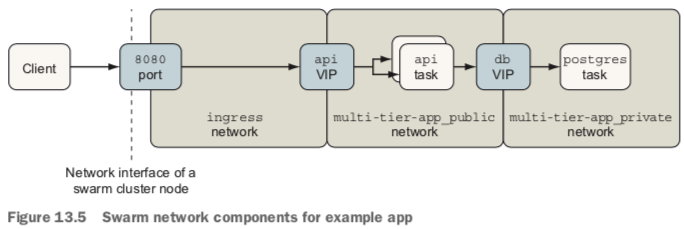
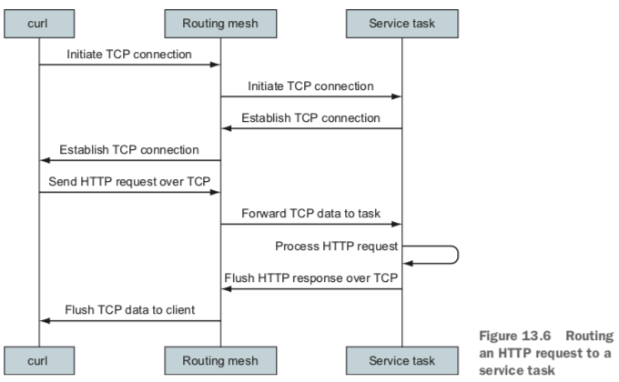
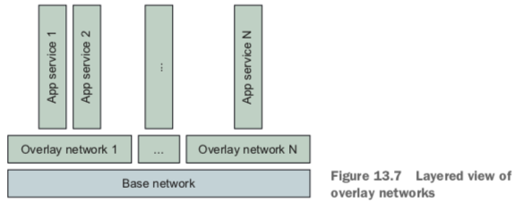
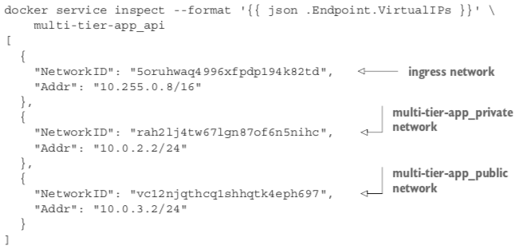
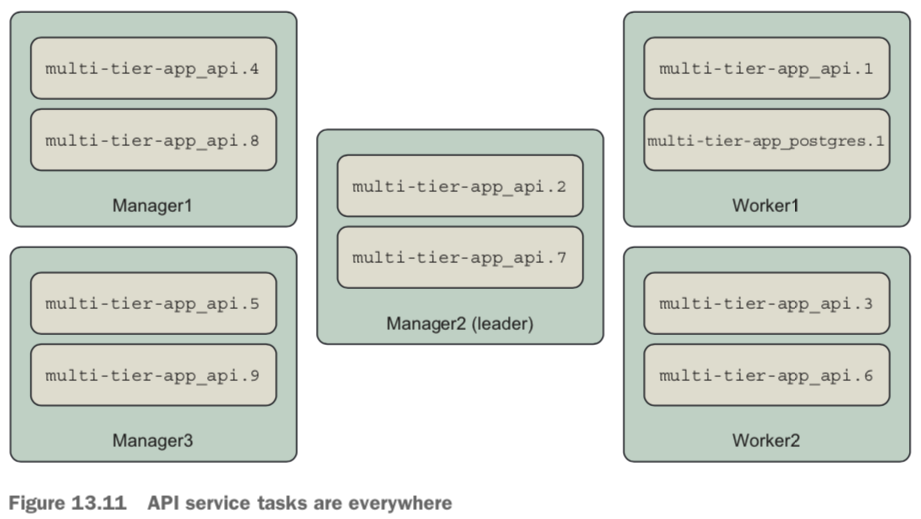

# Swarm cluster

The key Docker Swarm resource types are as follows:

- Services—A Docker service defines the application processes that run on the Swarm cluster’s nodes. Swarm managers interpret the service definition and create tasks that are executed on the cluster’s manager and worker nodes. Services are introduced in chapter 11.
- Tasks—Tasks define a containerized process that Swarm will schedule and run once until completion. A task that exits may be replaced by a new task, depending on the restart policy defined by the service. Tasks also specify dependencies on other cluster resources such as networks and secrets.
- Networks—Applications can use Docker overlay networks for traffic between ser- vices. Docker networks have low overhead, so you can create network topologies that suit your desired security model. Section 13.3.2 describes overlay networks.
- Volumes—Volumes provide persistent storage to service tasks. These volumes are bound to a single node. Volumes and mounts are described in chapter 4.
- Configs and secrets—Configurations and secrets (chapter 12) provide environment- specific configurations to services deployed on the cluster.

The application uses two networks, a `public network` handling requests coming from external clients, and a `private network` that is more trusted.

Swarm implements this listener with a combination of Linux `iptables` and `ipvs` features.

- An `iptables` rule redirects traffic to a dedicated `virtual IP` (VIP) allocated for the service. The service’s dedicated VIP is made available **across the swarm cluster** by using a Linux kernel feature called IP Virtual Server, `ipvs`.
- `IPVS` is a `transport-layer` load balancer that forwards requests for TCP or UDP services to their real endpoints. IPVS is **not** an application-layer load balancer for protocols such as HTTP. Swarm creates a VIP for each published Service port using ipvs. It then attaches the VIP to the ingress network, which is available across the Swarm cluster.

# Bypassing the routing mesh

An alternate `PublishMode` called `host` bypasses the routing mesh and attachment to the ingress network. When using this mode, clients connect directly to the service task on a given host. If a task is deployed there, it can handle the connection; otherwise, the connection attempt will fail.

This PublishMode is likely most appropriate for services that are deployed in `global mode` so that there is one, and only one, task for a particular service on a cluster node. This ensures that a task is available to handle requests and avoids port collisions.

# Overlay network and Ingress network

One way to think about an `overlay network` is that it enhances the user-defined bridge networks described in chapter 5 to span Docker hosts. Just as with a user- defined bridge network, all containers attached to an overlay network can commu- nicate with each other directly as peers. A special example of an overlay network is the `ingress` network.

The `ingress network` is a special-purpose overlay network that it is created by Docker when you initialize a swarm. The ingress network’s only responsibility is to route traffic from external clients connected to ports published by Docker services within the cluster. This network is managed by Swarm, and only Swarm can attach con- tainers to the ingress network. You should be aware that the default configuration of the ingress network is not encrypted.

# Cluster

Docker supports several node attributes that can be used as the basis of constraints:

- node.id—The unique identifier for the node in the Swarm cluster (for example, ucetqsmbh23vuk6mwy9itv3xo)
- node.hostname—The node’s hostname, (for example, worker2)
- node.role—The node’s role in the cluster, either manager or worker
- node.labels.<label name>—A label applied to the node by an operator (for example, a node with a zone=public label would have a node attribute of node.labels.zone=public)
- engine.labels—A set of labels describing key properties of the node and Docker Engine such as Docker version and operating system (for example, engine.labels.operatingsystem==ubuntu 16.04)

